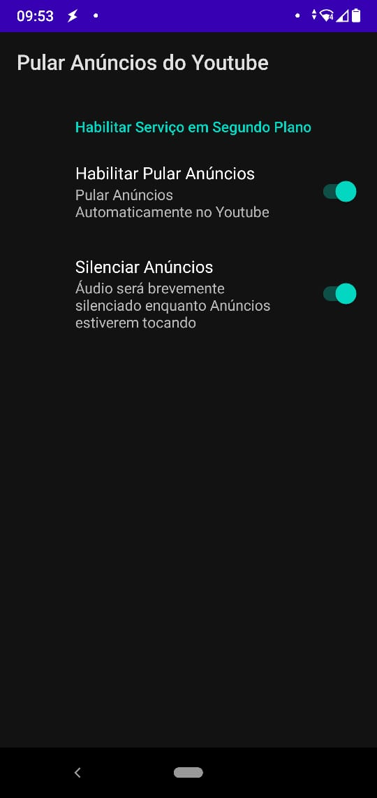

# Ad Skipper

## Screenshots

Open-source Android App that skips Video Ads on Youtube. Never worry about clicking "Skip Button" to skip annoying ads again! This app does it for you :)

Ad Skipper does three things when you open the Youtube app:
- Waits for Video Ads to appear;
- When Video Ad appears, it mutes the media volume;
- Clicks the <kbd>Skip Ad</kbd> button as soon as it appears and unmute the media volume.

Ad Skipper acts as an Accessibility Service, so after installing it, you need to enable it manually, as Accessibility services have elevated permissions on your device and can read and interact with all the device's screen.

However, Ad Skipper only acts on Youtube app's screen. Feel free to check the source code :)

This app is not affiliated with YouTube or Google.

## Getting Started

This app uses Android's [AccessibilityService](https://developer.android.com/guide/topics/ui/accessibility/service) API, so it is registered as an Accessibility Service.

Follow the below steps to activate it:

- [Install apk](https://github.com/alfeugds/adskipper/releases/latest);
- Open the app and click "Enable Ad Skipper"
- It will open the `Settings -> Accessibility` screen. Select **Ad Skipper** on the list and enable the service;
- Android will warn that the app will have access to see and interact with all screens. Confirm the option to enable the service;
- Enjoy :)

## Building it yourself

This is a standard Android Studio Project, so you can import this project in Android Studio and just build it.
The .apk will be at app\build\outputs\apk\debug\app-debug.apk
